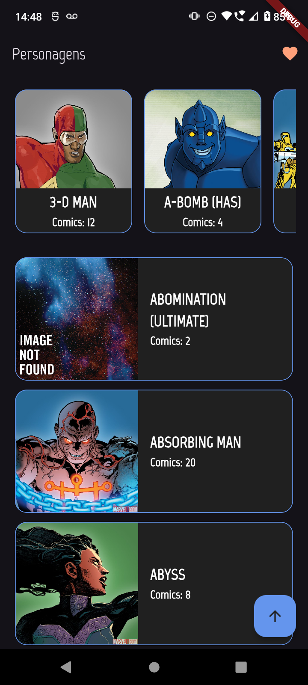
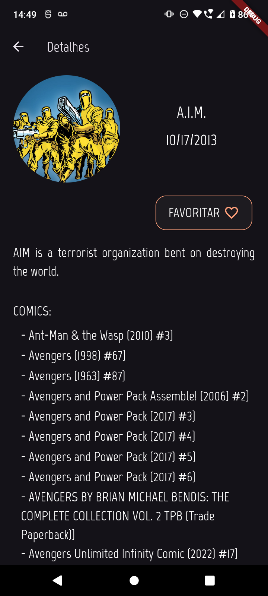
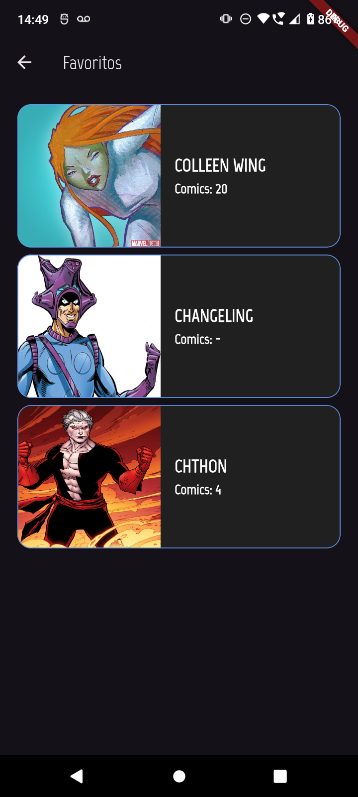

# Marvel App

App flutter que utiliza a [Marvel API](https://developer.marvel.com/)

  

## Arquitetura

Padrão Bloc + Clean Architecture

## Principais dependências
- [FlutterBloc](https://pub.dev/packages/flutter_bloc)
- [http](https://pub.dev/packages/http)
- [GoRouter](https://pub.dev/packages/go_router)
- [Mockito](https://pub.dev/packages/mockito)
- [GetIt](https://pub.dev/packages/get_it)
- [Hive](https://pub.dev/packages/hive)
